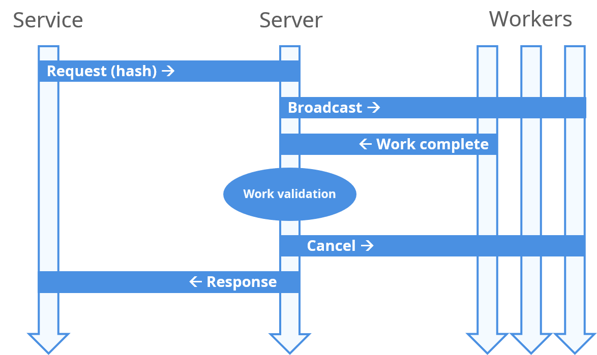

# Nano DPoW

Welcome to the Distributed Proof of Work (DPoW) system. The DPoW system allows any user to support Nano community services by computing the required proof of work for transactions.

DPoW has helped reduce operating costs of community projects, such as faucets, tipping bots, and wallets. As a reward for helping, clients get occasional Nano payouts.

## Why does this exist

In the [Nano](https://nano.org) protocol, every [block](https://medium.com/nano-education/nano-how-2-blocks-and-lattices-c0ccd417bd5a) must contain a small [proof of work](https://medium.com/nano-education/nano-how-4-proof-of-work-474bf20fc7d) to be confirmed by the network. While a desktop with a modern graphics card can easily and quickly compute this proof, the process can require significant resources from a server and mobile devices. Services often need to scale quickly when there is an uptick in usage, and on-demand scalable solutions based on GPUs are not available given the time-to-deploy requirements.

DPoW provides a **hub between services and clients who are happy to provide their resources**, in return for small payouts. Consequently, services save significantly on operating costs to operate on the Nano network.

## How does it work

The image above outlines the flow of messages within the system. Services request a proof of work for a specific block (hash) from the server. The server broadcasts a request using the low-latency MQTT protocol. The first worker (client) to return valid work is rewarded, and immediately a message is sent so other clients know they can cancel the ongoing computation. Meanwhile, the work is returned to the service.

## Using DPoW

### Documentation

You can read more about the DPoW [message specification](docs/specification.md).

### Running a work client

Read more on the [client documentation](client/README.md) page.

### Requesting work for your service

Read more on the [service documentation](service/README.md) page.

Please contact us on The Nano Center [discord server](https://discord.nanocenter.org) for further assistance.

### Running your own server

Read more on the [server documentation](server/README.md) page.

We have made efforts to make it easier for anyone to run a DPoW server for themselves. If you need any assistance, please use the [discord server](https://discord.nanocenter.org) or Github issues page.

## Resources

### DPoW servers deployed - Dashboard

- [DPoW](https://dpow.nanos.cc/) - the original, improved
- [BoomPoW](https://bpow.banano.cc/) - used by Banano, has contributed some improvements to DPoW

### Alternative approaches

- [P2PoW](https://anarkrypto.github.io/P2PoW) is a P2P protocol which allows users to trustlessly request work from others. It is more inefficient than DPoW, as it requires two blocks for each request, but removes the middleman (server) which is a central point of failure of the system.
